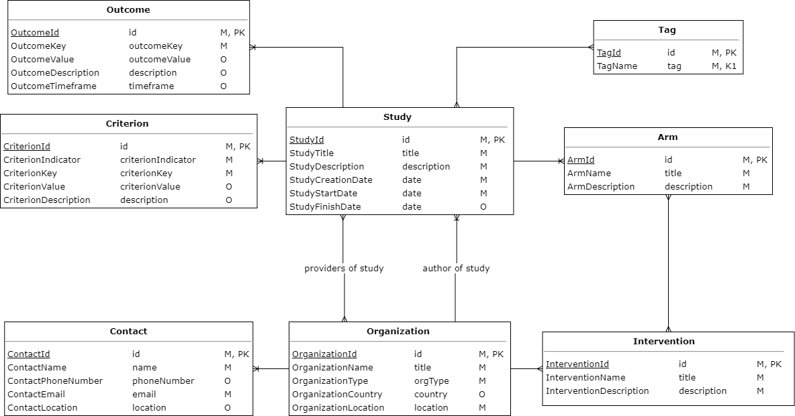
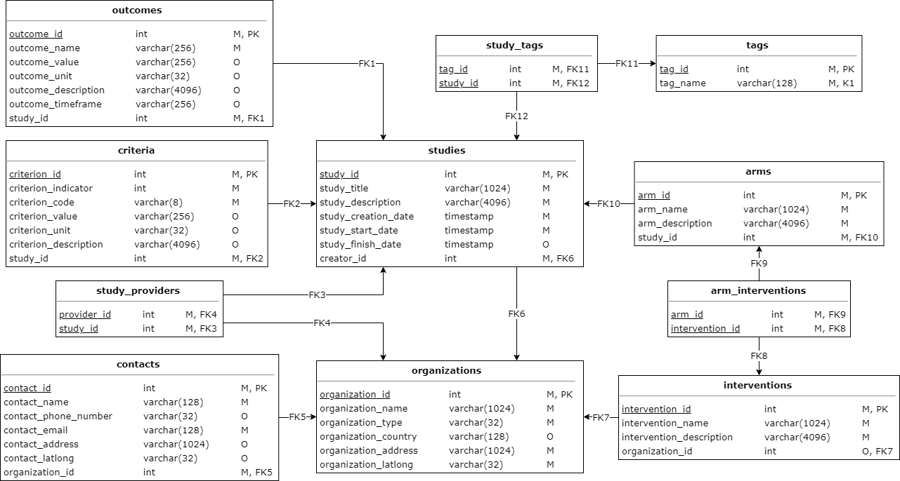

# Проект

## Задания для проекта

1. Выберите тему проекта.
2. Сделайте предварительную схему для БД проекта на основе моделей.
3. Определите набор атрибутов, необходимых для проекта, и определите отношения на них.
4. Найдите функциональные зависимости полученных отношений.
5. Найдите все ключи полученных отношений.
6. Найдите неприводимые множества функциональных зависимостей для полученных отношений.
7. Приведите схему базы в пятую нормальную форму. Если итоговая схема не будет в НФ-5, то обоснуйте принятое решение.
8. Запишите определения таблиц на языке SQL.
9. Запишите на языке SQL наполнение таблиц тестовым данными.
10. Определите и реализуйте на языке SQL запросы (в том числе, агрегирующие), необходимые для работы проекта.
11. Определите и реализуйте на языке SQL модифицирующие запросы, необходимые для работоспособности проекта.
12. Определите и реализуйте на языке SQL индексы (и их типы), необходимые для эффективного исполнения запросов.
13. Определите и реализуйте на языке SQL хранимые процедуры и функции, необходимые для работы проекта.
14. Определите минимальный уровень изоляции транзакций, необходимый для каждого запроса и хранимой процедуры.

## Описание проекта

В качестве темы была выбрана модель клинических исследований. Проект описывает структуру хранения общей информации о
клинических исследованиях, о критериях для пациентов, сведения о группах исследования и используемых препаратах и
девайсах, а так же об организациях.

## Решение

Проект состоит из следующих файлов:

* Модель сущность-связь ([drawio](src/model-schema.drawio), [png](img/model-schema.png))
  
* Физическая модель ([drawio](src/physical-schema.drawio), [png](img/physical-schema.png))
  
* Схема базы данных ([ddl.sql](src/ddl.sql))
* Заполнение данными ([data.sql](src/data.sql))
* Запросы на поиск и агрегацию ([selects.sql](src/selects.sql))
* Запросы на изменение данных ([updates.sql](src/updates.sql)) — к сожалению, эта часть задания практически не выполнена
